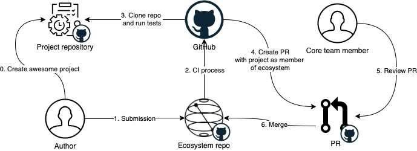

# Project Overview

The Ecosystem consists of projects, tools, utilities, libraries and tutorials from a broad community of developers and researchers.
The goal of the Ecosystem is to recognize, support and accelerate development of quantum technologies using Qiskit.

## Contents

- [Background](#background)
- [Solution explanation](#solution-explanation)
  - [Adding project to the ecosystem](#adding-project-to-the-ecosystem)
  - [Minimal requirements for projects](#minimal-requirements-for-projects)
  - [Ecosystem tests configuration](#ecosystem-test-configuration)
    - [Example of configured project](#example-of-configured-project)
  - [Storage](#storage)
  - [Tests](#tests)
  - [Workflow diagram](#workflow-diagram)

## Background

As number of projects in Qiskit ecosystem is growing, we found it useful to create 
a curated list of libraries, open source repos, guides, games, demos, and other resources in order to
accelerate development of quantum technologies and provide more visibility for community projects.

## Solution Explanation

As entire repository is designed to be run through GitHub Actions,
we implemented ecosystem python package as runner of CLI commands
to be executed from steps in Actions. 

Entrypoint is ``manager.py`` file in the root of repository.

Example of commands:
```shell
python manager.py python_dev_tests https://github.com/IceKhan13/demo-implementation --python_version=py39
python manager.py python_stable_tests https://github.com/IceKhan13/demo-implementation --python_version=py39
```
or in general
```shell
python manager.py <NAME_OF_FUNCTION_IN_MANAGER_FILE> <POSITIONAL_ARGUMENT> [FLAGS]
```

### Adding project to the ecosystem

Anyone can add their project for review to be included in the ecosystem by
[submitting issue](https://github.com/qiskit-community/ecosystem/issues/new?assignees=octocat&labels=&template=submission.yml&title=%5BSubmission%5D%3A+).

Once issue created GH Actions starts running tests for repository. 
If all tests passed PR will be created automatically to add project to the ecosystem.
If test failed GH Actions will comment in the created issue.

Read [more on tests](#tests).

#### Minimal requirements for projects

By default project must have
- `tests` folder and test runnable discoverable unittest in this folder.
- `requirements.txt` file with list of dependencies for running tests and project

Alternatively, minimal requirements for project might be overwritten by introducing [ecosystem test configuration](#ecosystem-test-configuration).

#### Ecosystem test configuration

In order to help CI to currectly run tests for your repository you can put `ecosystem.json` file in a root of your project.

Structure of config file:
- dependencies_files: list[string] - files with package dependencies (ex: requirements.txt, packages.json)
- extra_dependencies: list[string] - names of additional packages to install before tests execution
- language: string - programming language for tests env. Only supported lang is Python at this moment.
- tests_command: list[string] - list of commands to execute tests

Example of `ecosystem.json`:

```json
{
    "dependencies_files": [
        "requirements.txt",
        "requirements-dev.txt"
    ],
    "extra_dependencies": [
        "pytest"
    ],
    "debian_dependencies": [
        "jq"
    ],
    "language": {
        "name": "python",
        "versions": ["3.9"]
    },
    "tests_command": [
        "pytest"
    ],
    "styles_check_command": [
        "pylint -rn src tests"
    ],
    "coverages_check_command": [
        "coverage3 run -m pytest",
        "coverage3 report --fail-under=80"
    ]
}
```
  
Alternatively configuration is stored for each project in [the state of ecosystem](#storage). 

##### Example of configured project: 
https://github.com/mickahell/qiskit-ecosystem_template.

### Storage

We store each member of the ecosystem as a TOML file under
[`ecosystem/resources/members`](https://github.com/qiskit-community/ecosystem/blob/main/ecosystem/resources/members);
these are the files you should edit when adding / updating members to the
ecosystem. Access to this file is handled through the
[`DAO`](https://github.com/qiskit-community/ecosystem/blob/main/ecosystem/daos/dao.py)
class.

The qiskit.org page pulls information from the compiled
[`members.json`](https://github.com/qiskit-community/ecosystem/blob/main/ecosystem/resources/members.json))
file. This file should be compiled automatically by an action on pushing to
`main`, but you can also compile it locally (e.g. for testing) using

```sh
python -m manager recompile
```

You shouldn't edit `members.json` manually.

If you somehow get a merge conflict in `members.json`, don't try to manually
resolve the conflict. Instead, merge the branch, then run `python -m manager
recompile` and add the file to resolve the conflict.

### Tests

There are 3 type of tests for project: `STANDARD`, `DEV` and `STABLE`. 

`STANDARD` - runs tests with default requirements for project

CLI command:
```shell
python manager.py python_standard_tests <REPO_URL> --run_name=<NAME_OF_RUN> --python_version=py39 --tier=<TIER>
```

`DEV` - runs tests with default requirements for project + dev version of qiskit-terra installed

CLI command:
```shell
python manager.py python_dev_tests <REPO_URL> --run_name=<NAME_OF_RUN> --python_version=py39 --tier=<TIER>
```

`STABLE` - runs tests with default requirements for project + latest stable version of qiskit-terra installed

CLI command:
```shell
python manager.py python_stable_tests <REPO_URL> --run_name=<NAME_OF_RUN> --python_version=py39 --tier=<TIER>
```

You can see full setup on test running in [GitHub Action](https://github.com/qiskit-community/ecosystem/blob/main/.github/actions/run-tests/action.yml)

#### Workflow diagram


