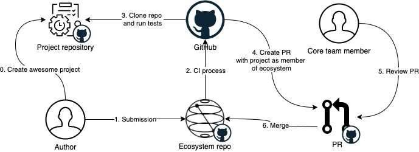

# Design doc: ecosystem

## Introduction

The ecosystem consists of projects, tools, utilities, libraries and tutorials from a broad community of developers and researchers.
The goal of this ecosystem is to recognize, support and accelerate development of quantum technologies using Qiskit.

## System Design and Architecture 

### System diagram or flowchart 

### Terminology and components

`GitHub Actions` - workflow automation framework by GitHub. See [GitHub Actions website](https://github.com/features/actions).

`Submission template` - github issue template for submission of project to join ecosystem. 
Includes: name, summary, contact information, alternatives, project url, licence, affiliations, labels.
For more information see [GitHub issue template documentation](https://docs.github.com/en/communities/using-templates-to-encourage-useful-issues-and-pull-requests/configuring-issue-templates-for-your-repository).

`Repo manager` - CLI with a set of utils to run specific for repository tasks (like parse issues, generating new readmes, etc.)

`Badge` - tag/badge for repository specifying membership tier of ecosystem

`Tier` - level of membership. Levels: `main`, `partner`, `candidate` (TBD)

### Hard and soft dependencies

- GitHub Actions - all CI processes are relying on actions.

### Workflows

#### Joining ecosystem
- author submits issues with `Submission template` and specify all required information in it.
- CI processes triggered on issue submission:
  - checks that all necessary information is there
     - if not: comment on issue and ask author to specify missing information
  - runs tests, lint, coverage checks 
     - if something is failing: comment on submission issue and create issue against repository to fix what is missing
  - add new entry to candidates list, generate new readme and push changes to branch
  - create PR against ecosystem repository with new candidate
- core team review PR
- CI process triggered on PR merge
  - generate badge
  - create issue against submitted project repository with specification of adding badge to repository

#### Ecosystem maintenance
- cron job (weekly)
- CI process:
  - foreach candidate repository:
    - clone repo and run tests, lint, coverage
      - if something failed: create issue against repo with description of problems and remove from candidates tier to pending
  - create PR with weekly check and changes
- core team review PR

### **Data definition, schema design and Persistence requirements**

Data will be stored as JSON serialized files within `/resources` folder.

**Files**:
- `repos.json` - list of ecosystem's candidates repositories
- `changes.json` - list of changes in tiers

**Repository entry schema**:
- `name: str` - name of project
- `summary: str` - summary of project
- `contact_information: optional[str]` - contact information of author
- `alternatives: optional[list[str]]` - alternatives of project, if any
- `project_repo_url: str` - repository url for project
- `licence: str` - license
- `affiliations: optional[list[str]]` - affiliated organizations
- `labels: optional[list[str]]` - labels for project

**Change entry schema**:
- `date: timestamp` - datetime of event
- `from: optional[str]` - tier change from
- `to: str` - tier change to

## Assumptions

Ecosystem management process is fully open and available for any member of community.

## Constraints / Limitations

GitHub Actions load / concurrent jobs execution for organization.

## Rollout Plan

- Ecosystem submission templates without CI
- Ecosystem membership: Main modules
- [CI submission](#joining-ecosystem)
- [CI maintenance](#ecosystem-maintenance)
- Ecosystem membership: Partners
- Ecosystem membership: Candidates
- Data integration with org site

## Test Plan

- util tests for manager cli
- integration tests for manager
- manual regression submission tests

## Appendix 
